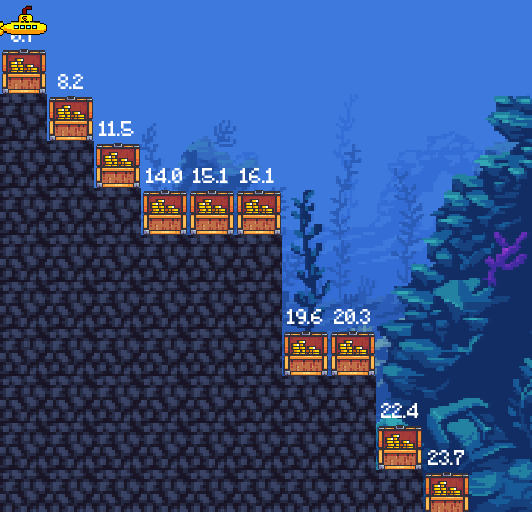
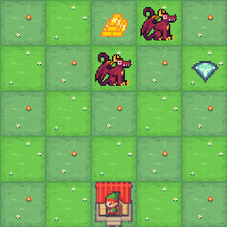
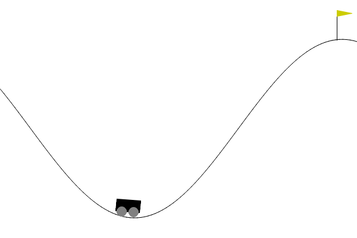
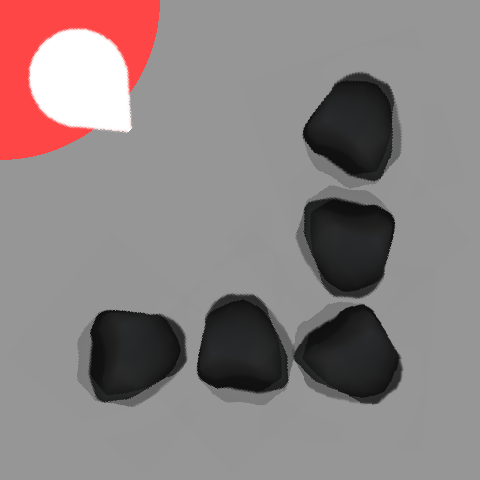
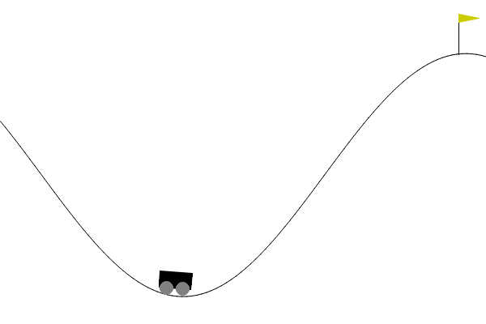
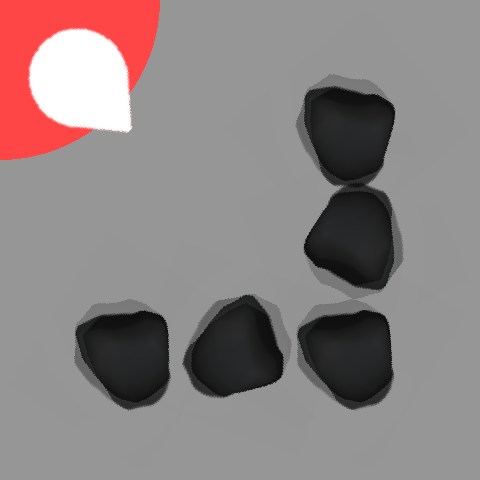

# Multi-Objective Reinforcement Learning (MORL)

Implementaciones educativas de MORL para un curso de posgrado en Aprendizaje por Refuerzo.  
Se exploran ambientes de [MO-Gymnasium](https://mo-gymnasium.farama.org/) con algoritmos de [MORL-Baselines](https://lucasalegre.github.io/morl-baselines/).

---

## Ambientes y Agentes

| Ambiente | Objetivos | Algoritmo | Agente entrenado |
|---|---|---|---|
| **Deep Sea Treasure** | 2 (tiempo, tesoro) | PQL + Q-Learning Escalarizado |  |
| **Resource Gathering** | 3 (muerte, oro, diamante) | GPI-LS + Q-Learning Escalarizado |  |
| **Mountain Car** | 3 (tiempo, accel. izq., accel. der.) | PCN + GPI-LS |  |
| **Minecart** | 3 (mineral 1, mineral 2, combustible) | PCN + GPI-LS |  |

### Ambientes — Políticas Aleatorias

| Deep Sea Treasure | Resource Gathering | Mountain Car | Minecart |
|---|---|---|---|
|  |  |  |  |

---

## Notebooks

### `deep_sea_treasure_morl.ipynb`
Análisis profundo del ambiente **Deep Sea Treasure** (cuadrícula 11×11, 10 tesoros con valores 1–124).

- Frente de Pareto verdadero (10 políticas conocidas analíticamente)
- **Q-Learning Escalarizado**: cómo distintos vectores de pesos `w = [w_tesoro, w_tiempo]` generan políticas en diferentes puntos del frente
- **Pareto Q-Learning (PQL)**: algoritmo tabular multi-política que descubre el frente completo en una sola ejecución
- Análisis de parámetros: gamma, epsilon, alpha, ref_point
- Comparación de cobertura: escalarización (casco convexo) vs PQL (frente completo)

### `resource_gathering_morl.ipynb`
Análisis profundo del ambiente **Resource Gathering** (cuadrícula 5×5, 3 objetivos, transiciones estocásticas).

- Frente de Pareto verdadero (4 estrategias: ninguno, solo oro, solo diamante, ambos)
- **Q-Learning Escalarizado**: pesos tridimensionales `w = [w_muerte, w_oro, w_diamante]`
- **MPMOQLearning con GPI-LS**: multi-política tabular, selección de pesos mediante Generalised Policy Improvement
- Análisis de parámetros: gamma, epsilon, random vs gpi-ls
- Visualizaciones del frente en proyecciones 2D

### `mountain_car_morl.ipynb`
Análisis profundo del ambiente **Mountain Car** (`mo-mountaincar-v0`, estado continuo en ℝ², 3 objetivos).

- Espacio de objetivos en ℝ³ estimado con política aleatoria (150 episodios)
- Por qué PQL falla: estado continuo incompatible con tabla Q
- **PCN**: red condicionada en retorno objetivo; evaluación con distintos deseos
- **GPI-LS** neuronal: pesos como preferencias relativas; Linear Support automático
- Análisis: `scaling_factor` y su impacto en el aprendizaje
- Comparación PCN vs GPI-LS sobre el espacio de objetivos

### `minecart_morl.ipynb`
Análisis profundo del ambiente **Minecart** (`minecart-deterministic-v0`, estado continuo en ℝ⁷, 3 objetivos).

- Frente de Pareto verdadero 3D via `env.unwrapped.pareto_front(gamma)`
- **PCN** (determinístico): condicionamiento en retorno mineral/combustible objetivo
- **GPI-LS** (estocástico, `minecart-v0`): pesos relativos + PER
- Análisis de `scaling_factor` para objetivos con escalas dispares
- Comparación cuantitativa de los puntos descubiertos vs el frente verdadero

### `multiobjective_Reinforcement_Learning_grupo4_202610.ipynb`
Survey de múltiples ambientes y algoritmos de MORL.

| Ambiente | Algoritmo | Características |
|---|---|---|
| Mountain Car | PQL | Espacio continuo (incompatible con tabular) |
| Deep Sea Treasure | PQL | Referencia tabular |
| Resource Gathering | MPMOQLearning + GPI-LS | Multi-política tabular |
| Minecart | PCN | Red neuronal, espacio continuo |
| Minecart | GPI-LS (GPILS) | Red neuronal, transiciones estocásticas |

---

## Conceptos Clave

### Dominancia de Pareto
Una política $\pi$ **domina** a $\pi'$ si:

$$\forall i: V_i(\pi) \geq V_i(\pi'), \quad \exists i: V_i(\pi) > V_i(\pi')$$

El **Frente de Pareto** es el conjunto de todas las políticas no dominadas: ningún objetivo puede mejorar sin empeorar otro.

### Escalarización Lineal
$$r_{scalar} = \mathbf{w} \cdot \mathbf{r} = \sum_i w_i r_i$$

Solo puede descubrir el **casco convexo** del frente. Para frentes no convexos se requiere un algoritmo multi-política.

### Pareto Q-Learning (PQL)
Mantiene un conjunto de Q-vectores Pareto-óptimos por par $(s, a)$. Descubre el frente completo en una sola ejecución de entrenamiento.

### MPMOQLearning + GPI-LS
Bucle externo gestiona la selección de pesos (Linear Support); bucle interno aprende una política para cada peso. La política GPI usa todos los Q-tables aprendidos:

$$\text{GPI}(s, \mathbf{w}) = \arg\max_a \max_\pi \mathbf{w}^\top \mathbf{Q}^\pi(s, a)$$

---

## Instalación

```bash
conda create -n cardozoenv python=3.10
conda activate cardozoenv
pip install mo-gymnasium morl-baselines imageio jupyter

# Para GPI-LS en macOS (requiere libgmp):
brew install gmp
CFLAGS="-I/opt/homebrew/include" LDFLAGS="-L/opt/homebrew/lib" pip install "pycddlib==2.1.6"
```

---

## Estructura del Repositorio

```
PRESENTACION/
├── deep_sea_treasure_morl.ipynb
├── resource_gathering_morl.ipynb
├── multiobjective_Reinforcement_Learning_grupo4_202610.ipynb
├── resources/
│   ├── env_gifs/          # GIFs de políticas aleatorias (incluidos en el repo)
│   └── agent_gifs/        # GIFs de agentes entrenados (incluidos en el repo)
└── README.md
```

> `videos/` y `weights/` se generan al ejecutar los notebooks y están en `.gitignore`.

---

## Referencias

- Vamplew et al. (2011). *Empirical evaluation methods for multi-objective reinforcement learning algorithms*. — Pareto Q-Learning
- Van Moffaert & Nowé (2014). *Multi-objective reinforcement learning using sets of Pareto dominating policies*. — GPI-LS
- Alegre et al. (2023). *MORL-Baselines: Multi-Objective Reinforcement Learning Algorithms*.
- Reymond et al. (2022). *Pareto Conditioned Networks*. — PCN
